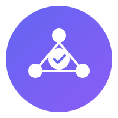

# IRRL — The Trust Protocol for the Autonomous Age

<p align="center">
  
</p>

<p align="center">
  <strong>When machines make decisions, how do they know who to trust?</strong>
</p>

<p align="center">
  <a href="#the-problem">Problem</a> •
  <a href="#the-solution">Solution</a> •
  <a href="#key-innovations">Innovations</a> •
  <a href="#quick-start">Quick Start</a> •
  <a href="./docs/specs/ATP.md">Protocol Spec</a>
</p>

---

## The World Has Changed

In 2024, AI agents started making real decisions: booking flights, writing code, managing infrastructure, trading assets. By 2025, agent-to-agent interactions became common. But we're using trust systems designed for humans rating restaurants.

**The old model:**
```
Human → Reviews → Human reads → Human decides
```

**The new reality:**
```
Agent → ??? → Agent queries → Agent decides in milliseconds
```

There's no "???" that works. Until now.

---

## The Problem

Every autonomous system faces the same unanswerable question:

> **"Should I trust this agent/service/data source for this specific task?"**

Current approaches fail because:

| Approach | Why It Fails for Agents |
|----------|------------------------|
| **Star Ratings** | No evidence, no context, no verification |
| **Social Proof** | Agents don't have friends |
| **Credentials** | Static, not task-specific |
| **Blockchain Reputation** | Too slow, too expensive, wrong abstraction |
| **API Keys** | Prove identity, not competence |

---

## The Solution: IRRL

IRRL is the **first trust protocol designed for autonomous systems**.

It answers: *"Why should I trust X for Y?"* with:
- **Verifiable evidence** (not opinions)
- **Contextual computation** (trust is domain-specific)
- **Composable algebra** (combine trust signals programmatically)
- **Real-time queries** (millisecond responses)
- **Cryptographic proofs** (verify without trusting the source)

```
┌─────────────────────────────────────────────────────────────────────┐
│                                                                     │
│  "Can I trust agent-X to deploy code to production?"                │
│                                                                     │
│  IRRL Response (14ms):                                              │
│  ┌─────────────────────────────────────────────────────────────┐   │
│  │ trust_score: 0.847                                          │   │
│  │ confidence: 0.92                                            │   │
│  │ evidence_chain:                                             │   │
│  │   - 847 successful deployments (verified via GitHub API)    │   │
│  │   - 0 security incidents (verified via CVE database)        │   │
│  │   - trusted by 12 other agents you trust (transitive)       │   │
│  │ proof: <verifiable cryptographic proof>                     │   │
│  │ valid_for: 3600s                                            │   │
│  └─────────────────────────────────────────────────────────────┘   │
│                                                                     │
└─────────────────────────────────────────────────────────────────────┘
```

---

## Key Innovations

### 1. 🧮 Trust Algebra

Compose trust signals like you compose functions:

```typescript
import { Trust, AND, OR, THRESHOLD, WEIGHTED } from '@irrl/core';

// Complex trust policy as code
const deploymentTrust = AND(
  Trust.from('code-quality').min(0.8),
  OR(
    Trust.from('security-audit').min(0.9),
    AND(
      Trust.from('peer-review').min(0.7),
      Trust.from('test-coverage').min(0.95)
    )
  ),
  THRESHOLD(3, [
    Trust.transitive('senior-devs', { maxDepth: 2 }),
    Trust.transitive('security-team', { maxDepth: 1 }),
    Trust.from('ci-cd-history').min(0.8),
    Trust.from('incident-response').min(0.7)
  ])
);

const canDeploy = await deploymentTrust.evaluate(agentId);
// { allowed: true, score: 0.847, proof: "..." }
```

### 2. 🔗 Evidence Chains

Every trust score links to verifiable evidence:

```
Trust Score: 0.847
    │
    ├── Direct Evidence (weight: 0.6)
    │   ├── github-activity: 847 commits verified ──→ [Resolver: GitHub API]
    │   ├── deployment-history: 99.2% success ──→ [Resolver: AWS CloudTrail]
    │   └── security-scan: 0 critical issues ──→ [Resolver: Snyk API]
    │
    └── Transitive Evidence (weight: 0.4)
        ├── trusted-by: agent-alpha (0.92) ──→ [Evaluation: eval_abc123]
        ├── trusted-by: agent-beta (0.88) ──→ [Evaluation: eval_def456]
        └── trusted-by: agent-gamma (0.85) ──→ [Evaluation: eval_ghi789]
```

### 3. 🎯 Trust Bonds

Put your reputation on the line:

```typescript
// Agent stakes reputation when making claims
const bond = await irrl.createBond({
  claim: "This code has no security vulnerabilities",
  stake: 50,  // Risk 50 reputation points
  evidence: { scanId: "scan_123", tool: "semgrep" },
  expiry: "30d"
});

// If proven wrong, reputation is slashed
// If proven right after challenge period, reputation is boosted
```

### 4. 🌐 Federated Trust Network

Multiple IRRL instances share trust across boundaries:

```
┌─────────────────┐     ┌─────────────────┐     ┌─────────────────┐
│   Company A     │     │   Company B     │     │   Public IRRL   │
│   IRRL Node     │◄───►│   IRRL Node     │◄───►│   Network       │
│                 │     │                 │     │                 │
│ Internal agents │     │ Internal agents │     │ Public agents   │
└─────────────────┘     └─────────────────┘     └─────────────────┘
         │                       │                       │
         └───────────────────────┴───────────────────────┘
                    Federated Trust Protocol
```

### 5. 🔐 Zero-Knowledge Proofs

Prove trust without revealing details:

```typescript
// Prove "I have reputation > 0.8 in security domain"
// WITHOUT revealing:
// - Exact reputation score
// - Who evaluated you
// - What evidence exists
const zkProof = await irrl.generateZKProof({
  claim: { domain: "security", minScore: 0.8 },
  subject: myAgentId
});

// Anyone can verify
const valid = await irrl.verifyZKProof(zkProof);
// true - but verifier learns nothing else
```

### 6. ⚡ Agent Trust Protocol (ATP)

Standard protocol for agent-to-agent trust negotiation:

```
Agent A                         Agent B
   │                               │
   │──── ATP:HELLO ───────────────►│
   │     (capabilities, trust_requirements)
   │                               │
   │◄─── ATP:CHALLENGE ────────────│
   │     (prove trust in domains X, Y)
   │                               │
   │──── ATP:PROOF ───────────────►│
   │     (zkproofs, evidence_refs)
   │                               │
   │◄─── ATP:ACCEPT ──────────────│
   │     (session_token, permissions)
   │                               │
   │◄───────── Trusted Channel ───►│
```

---

## Architecture

```
┌─────────────────────────────────────────────────────────────────────────┐
│                           IRRL Protocol Stack                           │
├─────────────────────────────────────────────────────────────────────────┤
│                                                                         │
│  ┌─────────────┐  ┌─────────────┐  ┌─────────────┐  ┌─────────────┐   │
│  │    ATP      │  │   Trust     │  │   ZK        │  │  Federation │   │
│  │  Protocol   │  │   Algebra   │  │   Proofs    │  │   Protocol  │   │
│  └──────┬──────┘  └──────┬──────┘  └──────┬──────┘  └──────┬──────┘   │
│         │                │                │                │          │
│  ┌──────┴────────────────┴────────────────┴────────────────┴──────┐   │
│  │                         IRRL Core                              │   │
│  │  ┌───────────┐  ┌───────────┐  ┌───────────┐  ┌───────────┐   │   │
│  │  │  Realms   │  │Attestations│ │ Evaluations│  │  Bonds    │   │   │
│  │  └───────────┘  └───────────┘  └───────────┘  └───────────┘   │   │
│  └────────────────────────────────────────────────────────────────┘   │
│                                   │                                    │
│  ┌────────────────────────────────┴───────────────────────────────┐   │
│  │                      Resolver Layer                            │   │
│  │  ┌─────────┐ ┌─────────┐ ┌─────────┐ ┌─────────┐ ┌─────────┐  │   │
│  │  │ GitHub  │ │   AWS   │ │  Snyk   │ │ Custom  │ │   ...   │  │   │
│  │  └─────────┘ └─────────┘ └─────────┘ └─────────┘ └─────────┘  │   │
│  └────────────────────────────────────────────────────────────────┘   │
│                                   │                                    │
│  ┌────────────────────────────────┴───────────────────────────────┐   │
│  │                      Storage Layer                             │   │
│  │         PostgreSQL │ SQLite │ Custom Adapter                   │   │
│  └────────────────────────────────────────────────────────────────┘   │
│                                                                         │
└─────────────────────────────────────────────────────────────────────────┘
```

---

## Quick Start

### Installation

```bash
# Node.js / TypeScript
npm install @irrl/core @irrl/sdk

# Python
pip install irrl

# Or run the full stack
docker-compose up -d
```

### Basic Usage

```typescript
import { IRRL, Trust } from '@irrl/sdk';

// Initialize
const irrl = new IRRL({
  endpoint: 'https://api.irrl.dev',  // Or self-hosted
  agentId: 'my-agent',
  privateKey: process.env.IRRL_PRIVATE_KEY
});

// Query trust
const trust = await irrl.query({
  subject: 'agent-xyz',
  domain: 'code-deployment',
  minConfidence: 0.8
});

if (trust.score >= 0.7) {
  // Proceed with interaction
}

// Create attestation with evidence
await irrl.attest({
  subject: 'agent-xyz',
  claim: 'Successfully deployed v2.3.1',
  evidence: {
    deploymentId: 'deploy_abc123',
    commitHash: 'a1b2c3d4',
    environment: 'production'
  },
  resolver: 'aws-cloudtrail'
});

// Stake reputation (Trust Bond)
await irrl.bond({
  claim: 'No regressions in deployment',
  stake: 25,
  evidence: { testRunId: 'test_xyz' },
  challengePeriod: '24h'
});
```

### Python Usage

```python
from irrl import IRRL, Trust, AND, OR

irrl = IRRL(
    endpoint="https://api.irrl.dev",
    agent_id="my-agent",
    private_key=os.environ["IRRL_PRIVATE_KEY"]
)

# Define trust policy
policy = AND(
    Trust.domain("security").min_score(0.8),
    OR(
        Trust.domain("code-quality").min_score(0.9),
        Trust.transitive("security-team", max_depth=2)
    )
)

# Evaluate
result = await irrl.evaluate(policy, subject="agent-xyz")
print(f"Trusted: {result.allowed}, Score: {result.score}")
```

---

## Use Cases

### 🤖 AI Agent Orchestration
```typescript
// Before delegating task to sub-agent
const canDelegate = await orchestrator.checkTrust({
  agent: subAgentId,
  task: 'database-migration',
  requirements: AND(
    Trust.domain('databases').min(0.85),
    Trust.domain('migrations').min(0.8),
    Trust.bond(10)  // Require stake
  )
});
```

### 🔒 Zero-Trust Security
```typescript
// Continuous trust verification
const session = await irrl.createSession({
  subject: requestingAgent,
  requirements: securityPolicy,
  revalidateEvery: '5m',
  onTrustDecay: () => session.terminate()
});
```

### 📊 Vendor/API Selection
```typescript
// Choose most trusted API provider
const providers = await irrl.rank({
  candidates: ['openai', 'anthropic', 'google'],
  domain: 'llm-inference',
  weights: {
    reliability: 0.4,
    latency: 0.3,
    cost: 0.3
  }
});
```

### 🏦 Automated Compliance
```typescript
// Prove compliance without revealing details
const complianceProof = await irrl.generateComplianceProof({
  requirements: ['SOC2', 'GDPR', 'HIPAA'],
  zkMode: true  // Zero-knowledge
});
```

---

## Comparison

| Feature | IRRL | EAS | Verifiable Credentials | Traditional APIs |
|---------|------|-----|----------------------|------------------|
| Agent-native | ✅ | ❌ | ❌ | ❌ |
| Trust Algebra | ✅ | ❌ | ❌ | ❌ |
| Evidence Chains | ✅ | ⚠️ | ⚠️ | ❌ |
| Trust Bonds | ✅ | ❌ | ❌ | ❌ |
| ZK Proofs | ✅ | ❌ | ⚠️ | ❌ |
| Federation | ✅ | ❌ | ⚠️ | ❌ |
| Millisecond queries | ✅ | ❌ | ✅ | ✅ |
| No blockchain required | ✅ | ❌ | ✅ | ✅ |
| Transitive trust | ✅ | ❌ | ❌ | ❌ |
| Temporal decay | ✅ | ❌ | ⚠️ | ❌ |

---

## Protocol Specification

See [ATP Protocol Specification](./docs/specs/ATP.md) for the full Agent Trust Protocol spec.

See [Trust Algebra Specification](./docs/specs/TRUST_ALGEBRA.md) for composable trust operators.

---

## Roadmap

- [x] Core trust computation engine
- [x] Trust Algebra operators
- [x] Evidence chain verification
- [x] Resolver framework
- [x] REST API
- [x] TypeScript SDK
- [x] Python SDK
- [ ] Trust Bonds (staking)
- [ ] Zero-Knowledge proofs
- [ ] ATP Protocol v1.0
- [ ] Federation protocol
- [ ] GraphQL API
- [ ] Rust SDK
- [ ] Browser extension
- [ ] VS Code extension

---

## Contributing

We're building the trust infrastructure for the autonomous age. Join us.

See [CONTRIBUTING.md](./CONTRIBUTING.md) for guidelines.

---

## License

MIT License — see [LICENSE](./LICENSE)

---

## Author

**Oscar Fuentes Fernández**  
Founder, NexThink AI

---

<p align="center">
  <em>"The autonomous age doesn't need more authentication.<br/>It needs infrastructure for trust."</em>
</p>

<p align="center">
  <strong>IRRL — Because machines need to know who to trust.</strong>
</p>
